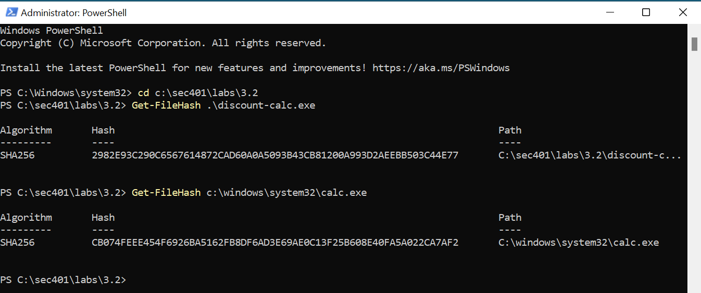
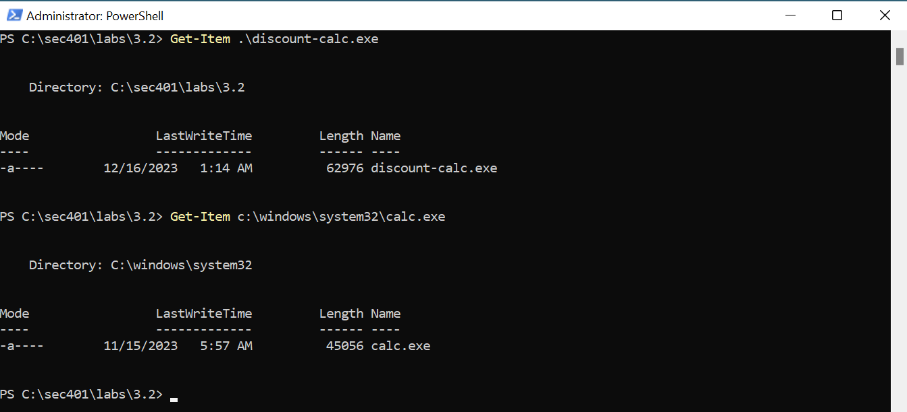
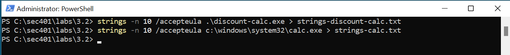
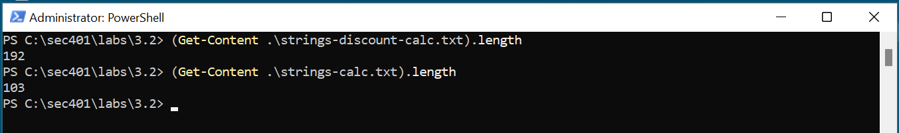
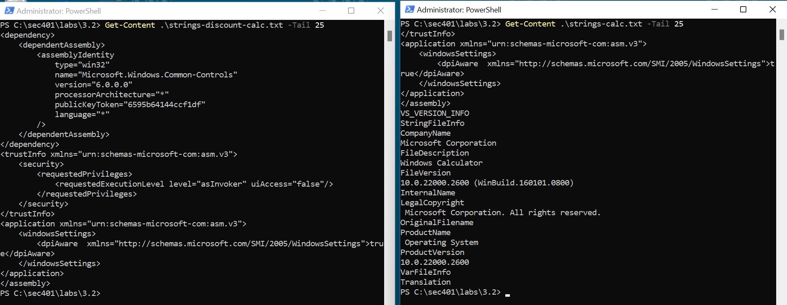
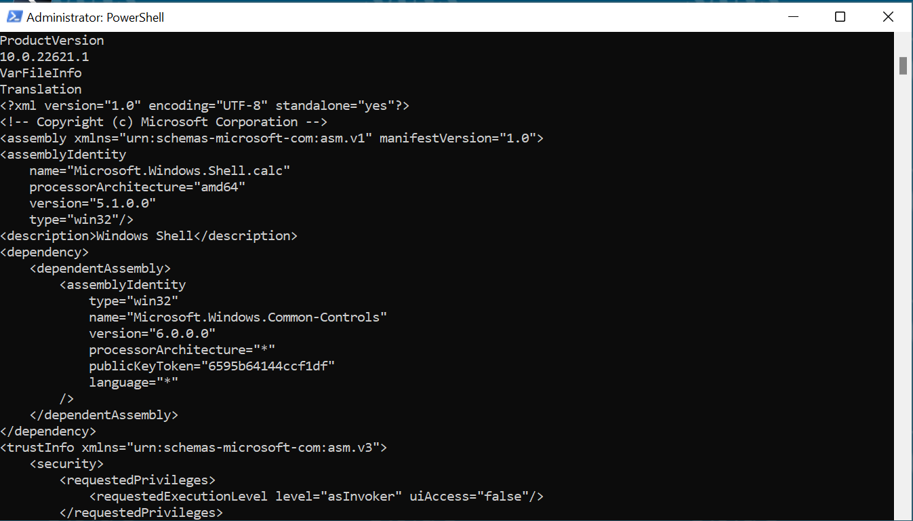
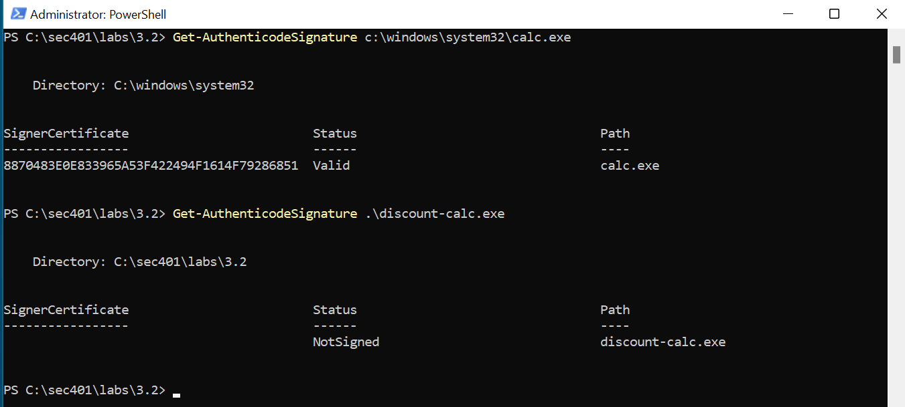

# Lab-3.2-Binary-File-Analysis

## Overview:

During my previous analysis of the network traffic in Wireshark, I extracted a potentially malicious executable called “discount-calc.exe”. Based on reports from Alpha.Inc customers, many received emails encouraging a download of a new discount calculator that would allow them to access discounted pricing. Upon investigation, the discount-calc.exe seemed to look and run just like the normal Windows Calculator calc.exe.  

## 1: Hashing

Before I start investigating the executable, I took an integrity hash to provide a unique identification, then compared it to the hash of the normal calc.exe. The hashes did not match, so while they may look similar, they are indeed different. 

## 2: Comparing File Sizes

I compared the two file sizes using Get-Item, and found that the discount-calc.exe contained more data. This indicated there is additional code inside the executable 

## 3: String of Interest

I used the strings executable to parse the strings from the discount-calculator and the normal calculator, using -n 10 to only parse strings with a minimum of 10 characters in length, and saved each to a new file. 

## 4: Comparing the Strings in Each Executable

Using the Get-Content, I found there are 192 lines in the strings-discount-calc.txt file and only 103 lines in the strings-calc.txt file. It is likely those additional strings could help me understand what the discount calculator is actually doing.  

## 5: Finding the Difference 

After comparing the first 25 lines of both string files, I used the tail command to compare the last 25 lines. In reviewing the output, the last 25 lines were different. This could mean the last 89 lines (192 -103 =89) are the different strings.

## 6: The Last 89 Lines
 
In reviewing the last 89 lines of the strings-discount-calc.txt file, I found and indicator for the Microsoft Windows Shell. 
Strings themselves do not indicate an issue on their own. They are a part of an application manifest (tells windows how to handle the executable). Here, the “Microsoft.Windows.Shell.calc” string would be present in the normal executable, but would normally only be present one time. The red-flag here is the duplication of manifest strings, suggesting the executable has been tampered with. Here, the malicious payload added to the legitimate calculator was used for command-line based command and control (C2) of the victim system. 

## 7: Digital Signatures

Many vendors digitally sign their executables, to attach ownership of an object to the integrity hash of that object (encrypting the integrity hash with a private key). When comparing the signatures of both executables, calc.exe was a properly signed executable, while discount-calc.exe was not. 

## Takeaways:

This lab demonstrated how attackers can disguise malicious executables to appear as legitimate applications, such as the Windows Calculator, in order to trick users into running malware. 

One of the biggest takeaways from this exercise was highlighting the importance of defending against phishing attacks. Cybercriminals very commonly use phishing emails with fake promotions, discounts, or urgent messages to manipulate users into downloading malicious files. Even if the executable looks trustworthy, behind the doors shows it can lead to system compromise.

This also reinforces the need for proper security controls against phishing, like email filtering, awareness training, and malware analysis. 

